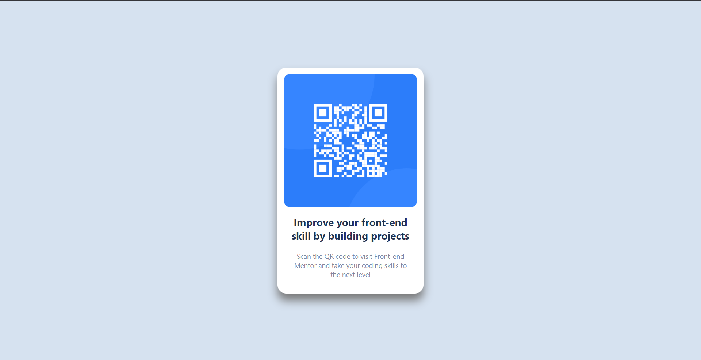

# FRONT-END MENTOR CHALLENGE

### QR CODE COMPONENT

## Table of contents

- [Overview](#overview)
  - [Screenshot](#screenshot)
  - [Links](#links)
- [My process](#my-process)
  - [Built with](#built-with)
- [Author](#author)

## Overview

### Screenshot

### Links

- Solution URL: [Add solution URL here](https://)
- Live Site URL: [Add live site URL here](https://)

## My process

### Built with

- Semantic HTML5 markup
- CSS custom properties
- Flexbox

## Author

<!-- - Website - [Add your name here](https://www.your-site.com) -->

- Frontend Mentor - [@moha_tangx](https://www.frontendmentor.io/profile/moha_tangx)
- Twitter - [@moha_tangx](https://www.twitter.com/moha_tangx)
- Instagram/Threads - [@moha-tangx](https://www.instagram.com/moha_tangx)
- LinkedIn - [moha_tangx](https://www.LinkedIn./profile/moha_tangx)
